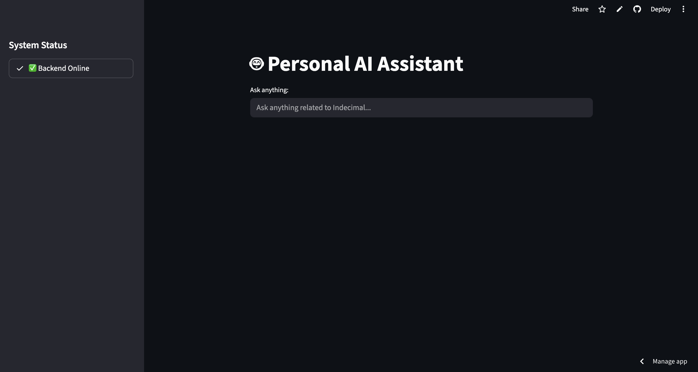
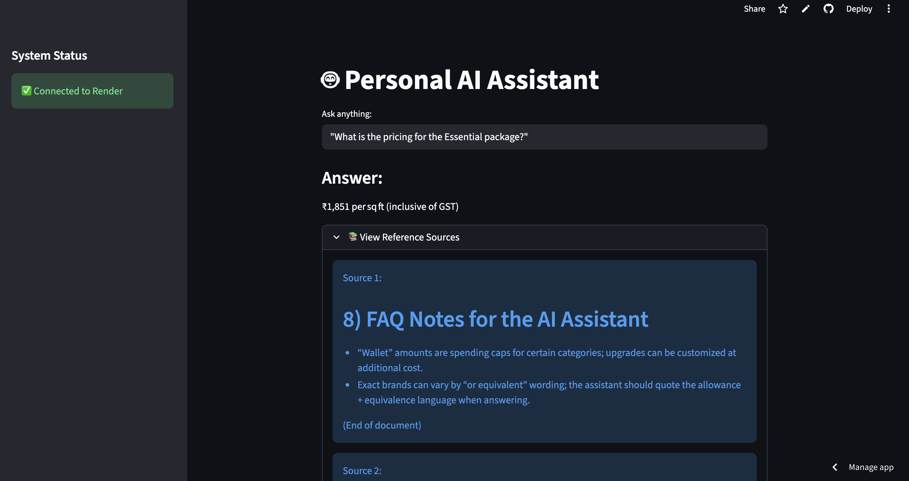
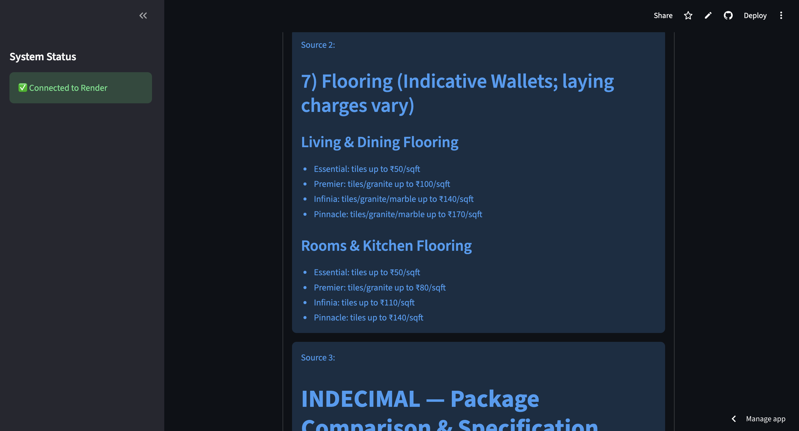
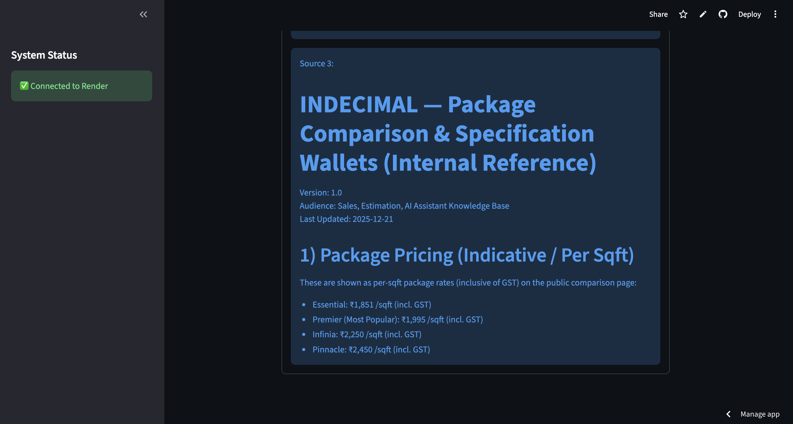
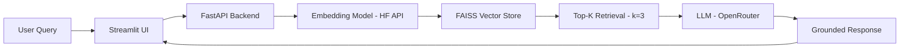

# 🤖 Personal AI RAG Assistant  
### *A Production-Ready Retrieval-Augmented Generation (RAG) Pipeline*

[](https://mini-rag-project-pq8w.onrender.com)
[](https://mini-rag-project-mohit.streamlit.app/)
[](https://www.python.org/)

---

## 🚀 Live Demo

<p align="center">
  <a href="https://mini-rag-project-mohit.streamlit.app/">
    
  </a>
  <a href="https://mini-rag-project-pq8w.onrender.com/">
    
  </a>
</p>

---

## 📸 Screenshots

### 🖥️ User Interface
<p align="center">
  
</p>

### 💬 Query Examples

<p align="center">
  
  <br><br>
  
  <br><br>
  
</p>

---

## 🧠 Overview

This project presents a production-ready **Retrieval-Augmented Generation (RAG)** pipeline built for an AI chatbot as part of the Indecimal hiring process.

> 📝 Developed as part of a real-world hiring assignment, focusing on production constraints, scalability, and reliable LLM behavior.


💡 It enables users to:
- Query internal PDF documents (policies, specifications, FAQs)
- Receive **accurate, context-aware responses**
- Avoid **LLM hallucinations** using strict grounding techniques

---

## 🛠️ Tech Stack

| Component | Technology | Why? |
| :--- | :--- | :--- |
| **LLM** | `Nemotron-3-Nano-30B-A3B` | Strong reasoning with efficient inference via OpenRouter |
| **Embeddings** | `all-MiniLM-L6-v2` | Industry-standard semantic similarity model |
| **Vector Store** | `FAISS` | Fast similarity search for high-dimensional embeddings |
| **Backend** | `FastAPI` | High-performance async API framework |
| **Frontend** | `Streamlit` | Simple, interactive UI for rapid prototyping |
| **Infrastructure**| `Render` & `Streamlit Cloud` | Lightweight and scalable deployment |

---

## 🏗️ Architecture & Workflow

```
User Query → Streamlit UI
           → FastAPI Backend
           → Embedding Model (HF API)
           → FAISS Vector Store
           → Top-K Retrieval (k=3)
           → LLM (OpenRouter)
           → Grounded Response → UI
```


---

## ⚙️ Implementation Details

### 1. Document Processing & Chunking
- Parsed PDFs using `PyPDF2`
- Split using `RecursiveCharacterTextSplitter`
- Used overlapping chunks to preserve semantic continuity

### 2. Vector Indexing & Retrieval
- Embeddings generated via Hugging Face Inference API
- Stored in local **FAISS index**
- Retrieved **Top-3 relevant chunks (k=3)** for each query

### 3. Grounded Answer Generation
- Strong **system prompt enforcement**
- Explicit fallback:  
  `"Answer not found in provided documents"`
- Low temperature (`0.2`) for factual consistency

---

## 🛡️ Production Optimizations

- ⚡ **Memory Optimization:** Switched to API-based embeddings to fit within Render's 512MB RAM limit  
- 🚀 **Lazy Loading:** Reduced startup time and ensured successful health checks  
- 🧩 **Decoupled Architecture:** Independent frontend & backend for scalability  
- 🔄 **Cold Start Handling:** Frontend polling mechanism for Render free-tier wake-up delays  

---

## 📊 Evaluation & Testing

The system was validated with real queries:

- ✅ Pricing-related queries (table lookup accuracy)  
- ✅ Specification-based queries (semantic retrieval)  
- ✅ Feature validation queries (factual correctness)  
- ❌ Out-of-context queries → Correctly rejected (anti-hallucination)

---

## 📦 Local Setup Instructions

> ⚠️ **Prerequisite:** Python **3.10 – 3.12** (tested on 3.12.2)

### 1. Clone the Repository
```bash
git clone https://github.com/Mohit9-y/mini-rag-project.git
cd mini-rag-project
```

### 2. Setup Backend
```bash
cd backend
pip install -r requirements.txt

# Create a .env file:
# OPENROUTER_API_KEY=your_key
# HF_TOKEN=your_huggingface_token

uvicorn main:app --reload
```

### 3. Setup Frontend
```bash
cd ../frontend
pip install -r requirements.txt
streamlit run app.py
```

---

## 🔮 Future Improvements

- 🔐 Authentication & user sessions  
- 📂 Multi-document upload support  
- 🌐 Deployment with Docker & CI/CD  
- 📈 Monitoring & logging (Prometheus/Grafana)  

---

## 👨‍💻 Author

**Mohit Yadav**  

🎓 Final Year, B.Tech in Electronics & Instrumentation Engineering  
🏫 National Institute of Technology (NIT), Silchar  

📧 Email: mohitpsf@gmail.com  
🔗 LinkedIn: [Profile](https://www.linkedin.com/in/mohit-yadav-2a7a87388/)
💻 GitHub: [Mohit9-y](https://github.com/Mohit9-y)

---